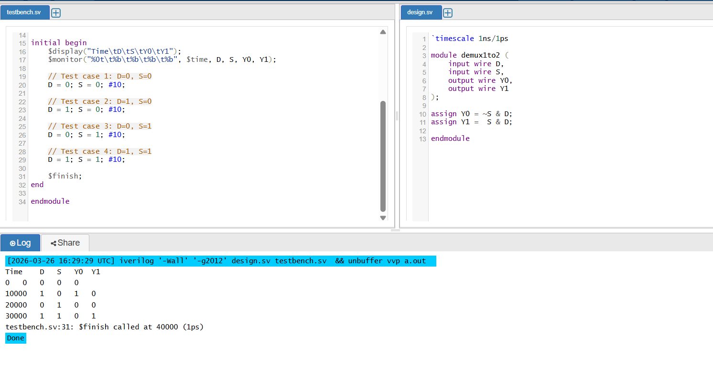

# 1:2 DEMUX (Demultiplexer)

## Overview
This project implements a **1:2 DEMUX (Demultiplexer)** in Verilog.

A demultiplexer does the opposite of a multiplexer.

- A **MUX** selects one input and sends it to one output.
- A **DEMUX** takes **one input** and sends it to **one of multiple outputs** based on the select line.

In this project:
- There is **1 data input** → `D`
- There is **1 select line** → `S`
- There are **2 outputs** → `Y0` and `Y1`

Depending on the select line, the input `D` is routed to either `Y0` or `Y1`.

---

## What This Project Does
In this project, I created a simple **1:2 DEMUX RTL design** and verified it using a **testbench**.

### Specifically, this project includes:
- Verilog RTL code for the **1:2 demultiplexer**
- A testbench to check all input and select combinations
- Simulation to confirm that the input is routed to the correct output
- Clean and beginner-friendly code for learning and portfolio use

---

## How It Works
The select line decides which output gets the input value.

### Selection logic:
- `S = 0` → `Y0 = D`, `Y1 = 0`
- `S = 1` → `Y0 = 0`, `Y1 = D`

---

## Files Included
- `demux1to2.v` → Verilog RTL code
- `tb_demux1to2.v` → Testbench for simulation

---

## Expected Output

| D | S | Y0 | Y1 |
|---|---|----|----|
| 0 | 0 | 0  | 0  |
| 1 | 0 | 1  | 0  |
| 0 | 1 | 0  | 0  |
| 1 | 1 | 0  | 1  |

This means the input `D` is sent to the output selected by `S`.

---

## How to Run
1. Open **EDA Playground** or any Verilog simulator
2. Copy `demux1to2.v` into the design file
3. Copy `tb_demux1to2.v` into the testbench file
4. Run the simulation
5. Check the console output or waveform

---

## Simulation Output

The screenshot  shows the simulation result for this project and confirms that the design is working as expected.

---

## Conclusion
This project is a simple example of **combinational logic design in Verilog**.

It helps in understanding:
- How demultiplexers work
- How a select line routes data
- How to write and test basic RTL modules
- How to build clean beginner-friendly VLSI portfolio projects
